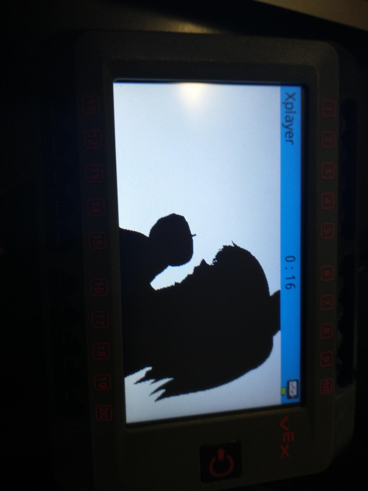

# Vex V5 video player.


This is insanly unstable and I do not recommend you use anything in this.
I **DO NOT** claim any copyright over bad apple or any frames from the video.

To use this you must upload the video to an sd card under the name of *vid.dat*





```
    © 2024 - HeronErin

    This program is free software: you can redistribute it and/or modify
    it under the terms of the GNU General Public License as published by
    the Free Software Foundation, either version 3 of the License, or
    (at your option) any later version.

    This program is distributed in the hope that it will be useful,
    but WITHOUT ANY WARRANTY; without even the implied warranty of
    MERCHANTABILITY or FITNESS FOR A PARTICULAR PURPOSE.  See the
    GNU General Public License for more details.

    You should have received a copy of the GNU General Public License
    along with this program.  If not, see <https://www.gnu.org/licenses/>.
```